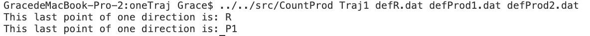
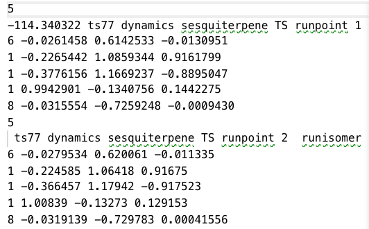
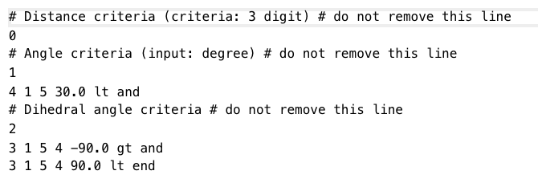
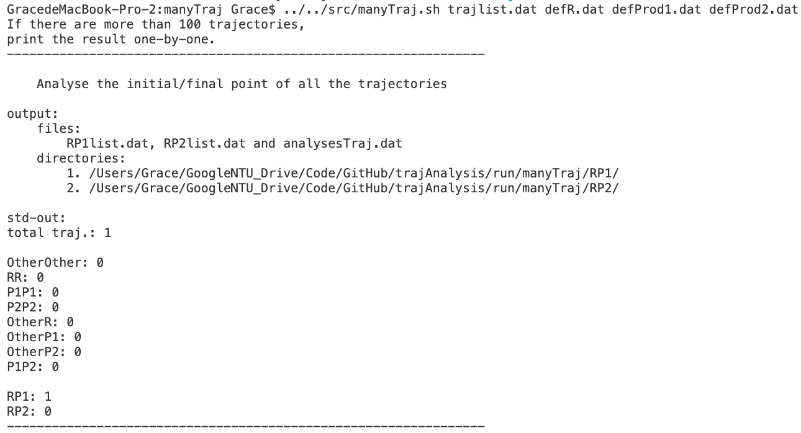

# Analyse dynamic trajectories 
Group the last points of a trajectories by user-define criteria. 
---
## Step1. Compile Fortran source code 

` ]$ ifort -debug all -o CountProd CountProd.f90`

- the executable file names `countProd`
- you can add more flags while compiling

## Step2. Analyse one trajectory in `/run/oneTraj`

` ]$ CondProd Traj1 defR.dat defProd1.dat defProd2.dat` 

        </img>

In Singleton's `ProgDyn` progam, the trajectory starts from a transition state and then ends at a local minimum by user-defined criteria, after that it goes back to the transition state to search the other local minimum. Thus, the structure of trajectory is 

> TS &rarr; Min1 &rarr; TS &rarr; Min2

In `CountProd`, the program extract the last points of trajectory, i.e., Min1 and Min2, to analyse their molecular structure. 

- Input 
  1. Traj1
  2. defR.dat
  3. defProd1.dat
  4. defProd2.dat

- **Traj1: serious of structures (XYZ coordinate)**
    - first line: amount of atom 
    - second line: comment line
    - following line: XYZ coordinat
     
    Repeat the above format in a trajectory. For example, there are 5 atom in the following figure, and the comment line starts from its electronic energy. After that, it prints out its Cartesian coordinate. 

     

        </img>
    
 

    

- **Three user-defined criteria (defR.dat, defProd1.dat and defProd2.dat)**
  - Format of def*.dat  
        

            </img>
        
 
    
    There are three types of geometric parameters (bond length, bond angle and dihedral angle) need to be defined, and the format is same. Keypoints are listed in the following three points. 
    1. First, the amount of criterion, 
       - i.e. 2 criteria to define dihedral angle in the above example. 
    2. Second, user-defined value and logic operator, 
       - i.e. dihedral angle for atom 3-1-5-4 is grater than -90 degree and less than 90 degree. 
    3. Make sure use `gt` and `lt` correctly, and use logical operator `and` and `or`. Add `end` in the last one. It is case-sensitive, please don't use capital. 

## Step3. Analyse many trajectories in `/run/manyTraj`

` ]$ manyTraj.sh trajlist.dat defR.dat defProd1.dat defProd2.dat` 

    </img>

 

This script calls program `CountProd.f90` to analyse trajectories, and then classify the result into output files/directories. 

- Input
  - trajlist.dat 
  - Traj1 
  - defR.dat
  - defProd1.dat
  - defProd2.dat

- Output 
  - files 
    - analysesTraj.dat
    - RP1list.dat 
    - RP2list.dat 
  - directories 
    - /RP1
    - /RP2
    
